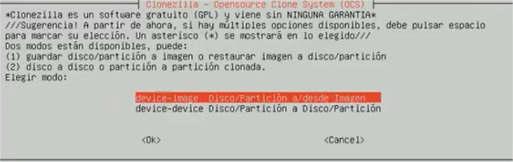
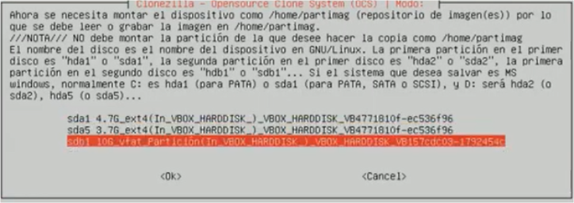
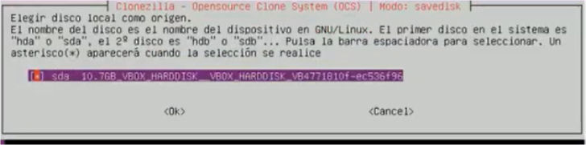

Manera de funcionament :

* *device-image:* Selecciona aquesta opció per a generar una imatge o per a restaurar una imatge.
* *Device-device:* S'utilitza per a clonar un disc o partició directament a un altre disc o partició.
 *Directori d'on llegir o on escriure la imatge:*
 

 * *local_dev:*  La imatge es farà en un disc local. Lògicament, com en tot linux,serà necessari muntar el dispositiu en el qual està o deixarem la imatge. No es
pot guardar la imatge en una de les particions que volem ficar dins de la imatge.
  * *ssh_server:* La imatge es lllegirao escriurà en una unitat de xarxa ssh.
  * *Samba_server:* La imatge es llegirà o escriurà en una carpeta compartida Samba (normalment Windows).
  * *Enter_shell:* Et permet entrar en la manera de comandos i muntar el teu mateix la unitat escrivint els comandos necessari.
  

  Escollim Device-image:

La imatge es farà a un disc local:

!!! warning

**Ctrl+c** per tornar a la pantalla gràfica.

Lloc en el qual es guardarà la imatge:

!!! danger

Triarem el disc creat, no agafarem el disc del nostre Sistema Operatiu.

Acceptem manera principiant:

Seleccionem savedisk per a realitzar una imatge d'un disc complet:

Seleccionem el nom de la imatge. En un entorn de producció, és habitual incloure la data com a part del nom de la imatge. És obligatori que el nom de la imatge guarde relació amb el sistema que s'estiga guardant. Aquests són alguns exemples:

  * 20140325-ServNexun
  * 20140325-WebServer-
  * 20140325-Proxy-AntesDeActualizacion

Com que hem seleccionat que volem fer una imatge d'un disc complet,en la següent pantalla, ens mostrarà els discos que estan connectats en l'equip perquè  triem els discos que volem incloure en la imatge. 

Seleccionem l'únic disc.

Comprovació després d'acabada la imatge. Allarga el procés, però es garanteix que s'ha realitzat correctament i que es pot restaurar.

Confirmació que volem continuar amb tot el procés del qual se'ns informa...

Finestra que ens indica el temps del procés de clonació.

Una vegada finalitzat el procés reiniciarà el Sistema Operatiu com li hem indicat, eliminarem les 3 carpetes creades al primer punt a l’escriptori i de nou canviarem el fons de pantalla al que teníem inicialment i apagarem el Sistema Operatiu.
