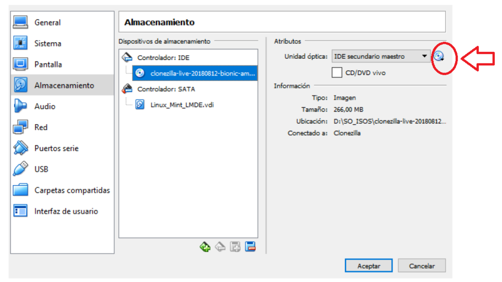
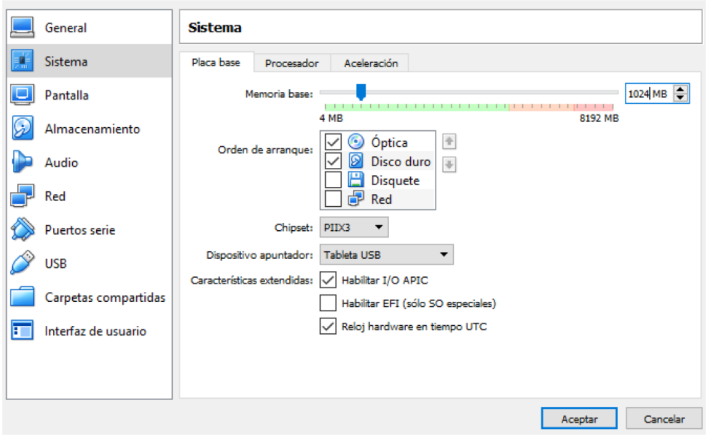

* Creem un nou disc dur al S.Operatiu que volem clonar, que és on es guardarà la imatge creada, amb el nom de: clonació_disc.
  
     

* Iniciarem el Sistema per poder particionar el disc dur creat amb el Gparted, li crearem la tabla de particions i després el configurarem amb el sistema d’arxius correcte.
* Creem 3 carpetes a l’escriptori i canviarem els fons de pantalla per verificar que la imatge es crea adequadament ( ja que després la anem a restaurar sobre el mateix disc dur).

* Configurem la màquina virtual perquè arranque des de CD i li indiquem la imatge ISO de Clonezilla Live.

    

* Iniciem la màquina virtual.
  
    